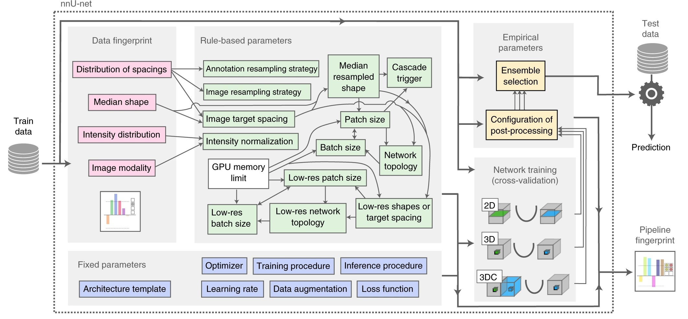

# 认识 nnUNet

## 为什么是 nnUNet
毫无疑问，UNet[1](#ref1) 几乎是卷积神经网络在医学图像分割领域的基线模型，也出现了许多 UNet 的改进版本，
如：V-Net[2](#ref2)，UNet++[3](#ref3)，nnU-Net[4](#ref4)，U2-Net[5](#ref5) 等。
但在所有改进版本中，nnUNet 作为是一种自适应框架，使用者只需要输入数据，nnUNet 动根据图像几何结构在网络架构、预训练、训练、推理方向上调整自身结构，
实现全自动分割流程，取得许多分割任务的 SOTA，成为许多创新方法对比的又一个 baseline。

nnUNet 框架下包含了数据预处理、网络框架设计、预测结果后处理、参数自动推理，这是一个深度学习医学图像分割，
甚至是医学图像处理的一个非常好的学习示例，如果你也想来入坑，那就让我们开始吧！

## nnUNet 工作流程
不同于自然图像，医学图像含有着许多特有的属性信息，如：模态（X-ray、CT、MRI）、体素大小（SpacingSize）、窗宽窗位（Window Width and Widow Level），
nnUnet 基于图像的这些“**指纹**”来自动推理预处理和网络参数，而这恰恰就是 nnUNet 最迷人的一个重要点，其工作流程主要如下图所示。

给定一个新的分割任务，nnUNet 会提取数据集的属性，即“数据集指纹”（粉红色）。
进而，根据“数据指纹”启发式规则对参数相互依赖性（显示为细箭头）进行建模，以推断管道的数据相关“基于规则的参数”（绿色）；
预定义的“固定参数”（蓝色）来确定训练和测试策略。
最后，nnU-Net 自动对模型的最佳集合进行经验选择，并确定是否需要后处理的“经验参数”（黄色）。

### 图像“指纹”（Data fingerprint）
建立图像数据中的指纹库，来确定预处理的策略，进一步来确定网络的结构，具体如下：
- 体素大小的分布（Distribution of spacings）：
- 感兴趣区域大小的中值大小（Median shape）：
- 感兴趣区域区域的体素强度分布（Intensity distribution）:
- 图像的模态（Image modality）：

### 需要根据规则来制定的参数（Rule-based parameters）
- 标注采样策略（Annotation resampling strategy）：
- 图像采样策略（Image resampling strategy）：
- 图像采样的体素大小（Image target spacing）：
- 图像归一化策略（Intensity normalization）：

### 固定参数（Fiexd parameters）
- 网络结构模板（Architecture template）：
- 优化器（Optimizer）：
- 训练步骤（Training procedure）：
- 推理步骤（Inference procedure）：
- 学习率（Learning rate）：
- 数据扩增策略（Data augmentation）：
- 损失函数（Loss function）：

### 经验参数（Empirical parameters）
- 待补充

### 参考文献

[1] U-net: Convolutional networks for biomedical image segmentation.

[2] V-Net: Fully Convolutional Neural Networks for Volumetric Medical Image Segmentation.

[3] UNet++: A Nested U-Net Architecturefor Medical Image Segmentation.

[4] nnU-Net: a self-configuring method for deep learning-based biomedical image segmentation.

[5] U2-Net: A Bayesian U-Net Model with Epistemic Uncertainty Feedback for Photoreceptor Layer Segmentation in Pathological OCT Scans.

